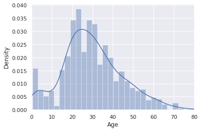
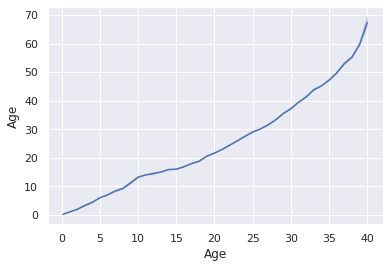
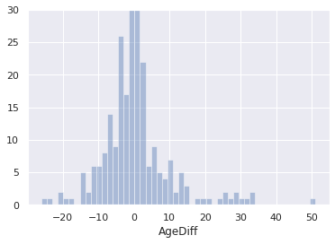

<a href="https://colab.research.google.com/github/Mjboothaus/titanic/blob/main/notebooks/eda_titanic_data.ipynb" target="_parent"></a>

# Examination of the veracity of the Titanic dataset in Kaggle


```python
import pandas as pd
import numpy as np
import matplotlib.pyplot as plt
import seaborn as sns
import difflib as dl
import warnings

warnings.filterwarnings("ignore")

from pathlib import Path

sns.set_style('whitegrid');
sns.set();
plt.figure(figsize=(18,6));

%matplotlib inline
```

## Import Titanic passenger list data

Is it possible to find actual date of birth for each passenger? These data sources only have age (it seems).

These data sets were downloaded from https://www.kaggle.com/c/titanic/data


```python
data_path = "../data"

data_url = "https://raw.githubusercontent.com/Mjboothaus/titanic/main/data"

```


```python
titanic_training_data_kaggle = pd.read_csv(f"{data_url}/train.csv")
titanic_test_data_kaggle = pd.read_csv(f"{data_url}/test.csv")
```


```python
titanic_training_data_kaggle.describe()
```


  <div id="df-a27ef8b9-8724-44c7-b9b9-7b5e084f484e">
    <div class="colab-df-container">
      <div>
<style scoped>
    .dataframe tbody tr th:only-of-type {
        vertical-align: middle;
    }

    .dataframe tbody tr th {
        vertical-align: top;
    }

    .dataframe thead th {
        text-align: right;
    }
</style>
<table border="1" class="dataframe">
  <thead>
    <tr style="text-align: right;">
      <th></th>
      <th>PassengerId</th>
      <th>Survived</th>
      <th>Pclass</th>
      <th>Age</th>
      <th>SibSp</th>
      <th>Parch</th>
      <th>Fare</th>
    </tr>
  </thead>
  <tbody>
    <tr>
      <th>count</th>
      <td>891.000000</td>
      <td>891.000000</td>
      <td>891.000000</td>
      <td>714.000000</td>
      <td>891.000000</td>
      <td>891.000000</td>
      <td>891.000000</td>
    </tr>
    <tr>
      <th>mean</th>
      <td>446.000000</td>
      <td>0.383838</td>
      <td>2.308642</td>
      <td>29.699118</td>
      <td>0.523008</td>
      <td>0.381594</td>
      <td>32.204208</td>
    </tr>
    <tr>
      <th>std</th>
      <td>257.353842</td>
      <td>0.486592</td>
      <td>0.836071</td>
      <td>14.526497</td>
      <td>1.102743</td>
      <td>0.806057</td>
      <td>49.693429</td>
    </tr>
    <tr>
      <th>min</th>
      <td>1.000000</td>
      <td>0.000000</td>
      <td>1.000000</td>
      <td>0.420000</td>
      <td>0.000000</td>
      <td>0.000000</td>
      <td>0.000000</td>
    </tr>
    <tr>
      <th>25%</th>
      <td>223.500000</td>
      <td>0.000000</td>
      <td>2.000000</td>
      <td>20.125000</td>
      <td>0.000000</td>
      <td>0.000000</td>
      <td>7.910400</td>
    </tr>
    <tr>
      <th>50%</th>
      <td>446.000000</td>
      <td>0.000000</td>
      <td>3.000000</td>
      <td>28.000000</td>
      <td>0.000000</td>
      <td>0.000000</td>
      <td>14.454200</td>
    </tr>
    <tr>
      <th>75%</th>
      <td>668.500000</td>
      <td>1.000000</td>
      <td>3.000000</td>
      <td>38.000000</td>
      <td>1.000000</td>
      <td>0.000000</td>
      <td>31.000000</td>
    </tr>
    <tr>
      <th>max</th>
      <td>891.000000</td>
      <td>1.000000</td>
      <td>3.000000</td>
      <td>80.000000</td>
      <td>8.000000</td>
      <td>6.000000</td>
      <td>512.329200</td>
    </tr>
  </tbody>
</table>
</div>
      <button class="colab-df-convert" onclick="convertToInteractive('df-a27ef8b9-8724-44c7-b9b9-7b5e084f484e')"
              title="Convert this dataframe to an interactive table."
              style="display:none;">

  <svg xmlns="http://www.w3.org/2000/svg" height="24px"viewBox="0 0 24 24"
       width="24px">
    <path d="M0 0h24v24H0V0z" fill="none"/>
    <path d="M18.56 5.44l.94 2.06.94-2.06 2.06-.94-2.06-.94-.94-2.06-.94 2.06-2.06.94zm-11 1L8.5 8.5l.94-2.06 2.06-.94-2.06-.94L8.5 2.5l-.94 2.06-2.06.94zm10 10l.94 2.06.94-2.06 2.06-.94-2.06-.94-.94-2.06-.94 2.06-2.06.94z"/><path d="M17.41 7.96l-1.37-1.37c-.4-.4-.92-.59-1.43-.59-.52 0-1.04.2-1.43.59L10.3 9.45l-7.72 7.72c-.78.78-.78 2.05 0 2.83L4 21.41c.39.39.9.59 1.41.59.51 0 1.02-.2 1.41-.59l7.78-7.78 2.81-2.81c.8-.78.8-2.07 0-2.86zM5.41 20L4 18.59l7.72-7.72 1.47 1.35L5.41 20z"/>
  </svg>
      </button>

  <style>
    .colab-df-container {
      display:flex;
      flex-wrap:wrap;
      gap: 12px;
    }

    .colab-df-convert {
      background-color: #E8F0FE;
      border: none;
      border-radius: 50%;
      cursor: pointer;
      display: none;
      fill: #1967D2;
      height: 32px;
      padding: 0 0 0 0;
      width: 32px;
    }

    .colab-df-convert:hover {
      background-color: #E2EBFA;
      box-shadow: 0px 1px 2px rgba(60, 64, 67, 0.3), 0px 1px 3px 1px rgba(60, 64, 67, 0.15);
      fill: #174EA6;
    }

    [theme=dark] .colab-df-convert {
      background-color: #3B4455;
      fill: #D2E3FC;
    }

    [theme=dark] .colab-df-convert:hover {
      background-color: #434B5C;
      box-shadow: 0px 1px 3px 1px rgba(0, 0, 0, 0.15);
      filter: drop-shadow(0px 1px 2px rgba(0, 0, 0, 0.3));
      fill: #FFFFFF;
    }
  </style>

      <script>
        const buttonEl =
          document.querySelector('#df-a27ef8b9-8724-44c7-b9b9-7b5e084f484e button.colab-df-convert');
        buttonEl.style.display =
          google.colab.kernel.accessAllowed ? 'block' : 'none';

        async function convertToInteractive(key) {
          const element = document.querySelector('#df-a27ef8b9-8724-44c7-b9b9-7b5e084f484e');
          const dataTable =
            await google.colab.kernel.invokeFunction('convertToInteractive',
                                                     [key], {});
          if (!dataTable) return;

          const docLinkHtml = 'Like what you see? Visit the ' +
            '<a target="_blank" href=https://colab.research.google.com/notebooks/data_table.ipynb>data table notebook</a>'
            + ' to learn more about interactive tables.';
          element.innerHTML = '';
          dataTable['output_type'] = 'display_data';
          await google.colab.output.renderOutput(dataTable, element);
          const docLink = document.createElement('div');
          docLink.innerHTML = docLinkHtml;
          element.appendChild(docLink);
        }
      </script>
    </div>
  </div>


```python
ax = sns.distplot(titanic_training_data_kaggle['Age'].dropna(), bins=30)
ax.set_xlim(0,80);

```


    

    


```python
titanic_training_data_kaggle['Name'] = titanic_training_data_kaggle['Name'].apply(lambda x : x.replace(u'\xa0', ' '))
```


```python
def extract_names(nameString, return_type):
    
    firstname = 'XXX NO FIRSTNAME XXX'
    othernames = ''
    
    tmp = nameString.split()
    if tmp[0][-1] == ',':
        surname = tmp[0][0:len(tmp[0])-1]
        title = tmp[1][0:len(tmp[1])-1]
        mynames = tmp[2:len(tmp)]
    else:
        surname = tmp[0] + ' ' + tmp[1][0:len(tmp[0])-1]
        title = tmp[2][0:len(tmp[2])-1]
        mynames = tmp[3:len(tmp)]

    firstname = mynames[0]
    othernames = ''
    for name in mynames[1:len(mynames)-1]:
        othernames = othernames + name + ' '
    othernames = othernames.rstrip()       
        
    try:
        if mynames[len(mynames)-1][-1] == ')':          # extract female/wife name
            othernames = ''
            for name in mynames:
                othernames = othernames + name + ' '
                if name[0] == '(':
                    othernames = ''
                    firstname = name[1:len(name)]
            othernames = othernames.rstrip()
            othernames = othernames[0:len(othernames)-1]             
    except:
        pass
    
    if return_type == 1:
        return title
    elif return_type == 2:
        return surname
    elif return_type == 3:
        return firstname
    else:
        return othernames
```


```python
titanic_training_data_kaggle.info()
```

    <class 'pandas.core.frame.DataFrame'>
    RangeIndex: 891 entries, 0 to 890
    Data columns (total 12 columns):
     #   Column       Non-Null Count  Dtype  
    ---  ------       --------------  -----  
     0   PassengerId  891 non-null    int64  
     1   Survived     891 non-null    int64  
     2   Pclass       891 non-null    int64  
     3   Name         891 non-null    object 
     4   Sex          891 non-null    object 
     5   Age          714 non-null    float64
     6   SibSp        891 non-null    int64  
     7   Parch        891 non-null    int64  
     8   Ticket       891 non-null    object 
     9   Fare         891 non-null    float64
     10  Cabin        204 non-null    object 
     11  Embarked     889 non-null    object 
    dtypes: float64(2), int64(5), object(5)
    memory usage: 83.7+ KB


```python
titanic_test_data_kaggle.info()
```

    <class 'pandas.core.frame.DataFrame'>
    RangeIndex: 418 entries, 0 to 417
    Data columns (total 11 columns):
     #   Column       Non-Null Count  Dtype  
    ---  ------       --------------  -----  
     0   PassengerId  418 non-null    int64  
     1   Pclass       418 non-null    int64  
     2   Name         418 non-null    object 
     3   Sex          418 non-null    object 
     4   Age          332 non-null    float64
     5   SibSp        418 non-null    int64  
     6   Parch        418 non-null    int64  
     7   Ticket       418 non-null    object 
     8   Fare         417 non-null    float64
     9   Cabin        91 non-null     object 
     10  Embarked     418 non-null    object 
    dtypes: float64(2), int64(4), object(5)
    memory usage: 36.0+ KB


Merge the Kaggle train and test datasets into one (for comparison to other Titanic data sets/sources)


```python
titanic_data_kaggle = pd.merge(titanic_training_data_kaggle, titanic_test_data_kaggle, how='outer')
```


```python
titanic_data_kaggle.info()
```

    <class 'pandas.core.frame.DataFrame'>
    Int64Index: 1309 entries, 0 to 1308
    Data columns (total 12 columns):
     #   Column       Non-Null Count  Dtype  
    ---  ------       --------------  -----  
     0   PassengerId  1309 non-null   int64  
     1   Survived     891 non-null    float64
     2   Pclass       1309 non-null   int64  
     3   Name         1309 non-null   object 
     4   Sex          1309 non-null   object 
     5   Age          1046 non-null   float64
     6   SibSp        1309 non-null   int64  
     7   Parch        1309 non-null   int64  
     8   Ticket       1309 non-null   object 
     9   Fare         1308 non-null   float64
     10  Cabin        295 non-null    object 
     11  Embarked     1307 non-null   object 
    dtypes: float64(3), int64(4), object(5)
    memory usage: 132.9+ KB


So in the combined dataset of 1309 (= 891 train + 418 test) passengers, there are 1046 non-null age values.

Let's extract the components of the 'Name' field into title, surname, first name and other names.


```python
titanic_data_kaggle['Title'] = titanic_data_kaggle['Name'].apply(lambda x : extract_names(x, 1))
titanic_data_kaggle['Surname'] = titanic_data_kaggle['Name'].apply(lambda x : extract_names(x, 2))
titanic_data_kaggle['Firstname'] = titanic_data_kaggle['Name'].apply(lambda x : extract_names(x, 3))
titanic_data_kaggle['Othernames'] = titanic_data_kaggle['Name'].apply(lambda x : extract_names(x, 4))
```


```python
titanic_data_kaggle_sort_age = titanic_data_kaggle.sort_values(by=['Age', 'Name'])
titanic_data_kaggle_sort_age.reset_index(inplace=True)
```

Now put the other dataset(s) age data on this plot too.


```python
titanic_data_wikipedia = pd.read_html('https://en.m.wikipedia.org/wiki/Passengers_of_the_RMS_Titanic',header=0)
```


```python
titanic_facts_tables = pd.read_html('http://www.titanicfacts.net/titanic-passenger-list.html',header=0)
```


```python
titanic_facts_tables[0].info()
```

    <class 'pandas.core.frame.DataFrame'>
    RangeIndex: 324 entries, 0 to 323
    Data columns (total 5 columns):
     #   Column                      Non-Null Count  Dtype 
    ---  ------                      --------------  ----- 
     0   Surname                     324 non-null    object
     1   First Names                 324 non-null    object
     2   Age                         324 non-null    object
     3   Boarded                     324 non-null    object
     4   Survivor (S) or Victim (†)  324 non-null    object
    dtypes: object(5)
    memory usage: 12.8+ KB


```python
titanic_facts_tables[1].info()
```

    <class 'pandas.core.frame.DataFrame'>
    RangeIndex: 284 entries, 0 to 283
    Data columns (total 5 columns):
     #   Column                      Non-Null Count  Dtype 
    ---  ------                      --------------  ----- 
     0   Surname                     284 non-null    object
     1   First Names                 284 non-null    object
     2   Age                         284 non-null    object
     3   Boarded                     284 non-null    object
     4   Survivor (S) or Victim (†)  284 non-null    object
    dtypes: object(5)
    memory usage: 11.2+ KB


```python
titanic_facts_tables[2].info()
```

    <class 'pandas.core.frame.DataFrame'>
    RangeIndex: 709 entries, 0 to 708
    Data columns (total 5 columns):
     #   Column                      Non-Null Count  Dtype 
    ---  ------                      --------------  ----- 
     0   Surname                     709 non-null    object
     1   First Names                 709 non-null    object
     2   Age                         709 non-null    object
     3   Boarded                     709 non-null    object
     4   Survivor (S) or Victim (†)  709 non-null    object
    dtypes: object(5)
    memory usage: 27.8+ KB


So the "Titanic Facts" has the data spread across 3 tables with 324 (1st class), 284 (2nd class) and 709 (3rd class) passengers (1317 total) respectively. There is age data for all 1317 passengers. Contrast this with 1309 passengers in the Kaggle dataset [which does not claim to be complete -- in fact, somewhat disappointingly, there does not appear to be a reference for the data] with only 1046 age values.


```python
titanic_facts = pd.merge(pd.merge(titanic_facts_tables[0], titanic_facts_tables[1], how='outer'), titanic_facts_tables[2], how='outer')
```


```python
def export_df_to_csv_file_if_path_exists(df, file_path):
  if Path(file_path).exists():
    df.to_csv(file_path)
    print(f"File exported to {file_path}")
  else:
    print(f"Unable to export to {file_path}")
```


```python
export_df_to_csv_file_if_path_exists(titanic_facts, f"{data_path}/titanic_facts.csv")
```

    Unable to export to ../data/titanic_facts.csv


```python
titanic_facts.info()
```

    <class 'pandas.core.frame.DataFrame'>
    Int64Index: 1317 entries, 0 to 1316
    Data columns (total 5 columns):
     #   Column                      Non-Null Count  Dtype 
    ---  ------                      --------------  ----- 
     0   Surname                     1317 non-null   object
     1   First Names                 1317 non-null   object
     2   Age                         1317 non-null   object
     3   Boarded                     1317 non-null   object
     4   Survivor (S) or Victim (†)  1317 non-null   object
    dtypes: object(5)
    memory usage: 61.7+ KB


```python
# Also could go heavy-handed with:
# pd.to_numeric(df['y'], errors='coerce')

def convert_age(age):
    try:
        return float(age)
    except Exception:
        try:
            return float(age[:-1]) / 12.0
        except Exception:
            return np.nan
```


```python
titanic_facts['Age'] = titanic_facts['Age'].apply(lambda age : convert_age(age))
```

Need to convert age from string to float


```python
titanic_facts_sort_age = titanic_facts.sort_values(by=['Age', 'Surname'])
titanic_facts_sort_age.reset_index(inplace=True)
```


```python
sns.lineplot(x=titanic_facts_sort_age['Age'], y=titanic_data_kaggle_sort_age['Age'])
```


    <matplotlib.axes._subplots.AxesSubplot at 0x7ffba4c945d0>


    

    


```python
# DEPRECATED

# sns.plt.plot(titanic_facts_sort_age['Age'])
# sns.plt.plot(titanic_data_kaggle_sort_age['Age'], 'g')
```


```python
titanic_facts_sort_age.info()
print()
titanic_data_kaggle_sort_age.info()
```

    <class 'pandas.core.frame.DataFrame'>
    RangeIndex: 1317 entries, 0 to 1316
    Data columns (total 6 columns):
     #   Column                      Non-Null Count  Dtype  
    ---  ------                      --------------  -----  
     0   index                       1317 non-null   int64  
     1   Surname                     1317 non-null   object 
     2   First Names                 1317 non-null   object 
     3   Age                         1315 non-null   float64
     4   Boarded                     1317 non-null   object 
     5   Survivor (S) or Victim (†)  1317 non-null   object 
    dtypes: float64(1), int64(1), object(4)
    memory usage: 61.9+ KB
    
    <class 'pandas.core.frame.DataFrame'>
    RangeIndex: 1309 entries, 0 to 1308
    Data columns (total 17 columns):
     #   Column       Non-Null Count  Dtype  
    ---  ------       --------------  -----  
     0   index        1309 non-null   int64  
     1   PassengerId  1309 non-null   int64  
     2   Survived     891 non-null    float64
     3   Pclass       1309 non-null   int64  
     4   Name         1309 non-null   object 
     5   Sex          1309 non-null   object 
     6   Age          1046 non-null   float64
     7   SibSp        1309 non-null   int64  
     8   Parch        1309 non-null   int64  
     9   Ticket       1309 non-null   object 
     10  Fare         1308 non-null   float64
     11  Cabin        295 non-null    object 
     12  Embarked     1307 non-null   object 
     13  Title        1309 non-null   object 
     14  Surname      1309 non-null   object 
     15  Firstname    1309 non-null   object 
     16  Othernames   1309 non-null   object 
    dtypes: float64(3), int64(5), object(9)
    memory usage: 174.0+ KB


```python
titanic_facts_sort_age['Name'] = titanic_facts_sort_age['Surname'] + titanic_facts_sort_age['First Names']
```

Test the operation of the get_close_matches( ) method to see if we can merge the datasets based on the name fields.


```python
for i in range(5):
    tmp = dl.get_close_matches(titanic_data_kaggle_sort_age['Name'].iloc[i], titanic_facts_sort_age['Name'])
    try:
        print(f'{len(tmp)}: {tmp[0]} / ' + titanic_data_kaggle_sort_age['Name'].iloc[i])
    except Exception:
        print('No match' + ' / ' + titanic_data_kaggle_sort_age['Name'].iloc[i])
              
```

    1: DeanMiss Elizabeth Gladys “Millvina” / Dean, Miss. Elizabeth Gladys Millvina""
    1: DanbomMaster Gilbert Sigvard Emanuel / Danbom, Master. Gilbert Sigvard Emanuel
    No match / Thomas, Master. Assad Alexander
    1: HämäläinenMaster Viljo Unto Johannes / Hamalainen, Master. Viljo
    2: BacliniMiss Eugenie / Baclini, Miss. Eugenie


```python
def match_name(name):
    try:
        return dl.get_close_matches(name, titanic_facts_sort_age['Name'])[0]
    except Exception:
        return 'No name match'

titanic_data_kaggle_sort_age['Name'] = titanic_data_kaggle_sort_age['Name'].apply(lambda name: match_name(name))
```


```python
titanic_data_kaggle_sort_age[titanic_data_kaggle_sort_age['Name']!='No name match']
```


  <div id="df-32fe85e4-276e-43ee-936f-fa3505dc58b6">
    <div class="colab-df-container">
      <div>
<style scoped>
    .dataframe tbody tr th:only-of-type {
        vertical-align: middle;
    }

    .dataframe tbody tr th {
        vertical-align: top;
    }

    .dataframe thead th {
        text-align: right;
    }
</style>
<table border="1" class="dataframe">
  <thead>
    <tr style="text-align: right;">
      <th></th>
      <th>index</th>
      <th>PassengerId</th>
      <th>Survived</th>
      <th>Pclass</th>
      <th>Name</th>
      <th>Sex</th>
      <th>Age</th>
      <th>SibSp</th>
      <th>Parch</th>
      <th>Ticket</th>
      <th>Fare</th>
      <th>Cabin</th>
      <th>Embarked</th>
      <th>Title</th>
      <th>Surname</th>
      <th>Firstname</th>
      <th>Othernames</th>
    </tr>
  </thead>
  <tbody>
    <tr>
      <th>0</th>
      <td>1245</td>
      <td>1246</td>
      <td>NaN</td>
      <td>3</td>
      <td>DeanMiss Elizabeth Gladys “Millvina”</td>
      <td>female</td>
      <td>0.17</td>
      <td>1</td>
      <td>2</td>
      <td>C.A. 2315</td>
      <td>20.5750</td>
      <td>NaN</td>
      <td>S</td>
      <td>Miss</td>
      <td>Dean</td>
      <td>Elizabeth</td>
      <td>Gladys</td>
    </tr>
    <tr>
      <th>1</th>
      <td>1092</td>
      <td>1093</td>
      <td>NaN</td>
      <td>3</td>
      <td>DanbomMaster Gilbert Sigvard Emanuel</td>
      <td>male</td>
      <td>0.33</td>
      <td>0</td>
      <td>2</td>
      <td>347080</td>
      <td>14.4000</td>
      <td>NaN</td>
      <td>S</td>
      <td>Master</td>
      <td>Danbom</td>
      <td>Gilbert</td>
      <td>Sigvard</td>
    </tr>
    <tr>
      <th>3</th>
      <td>755</td>
      <td>756</td>
      <td>1.0</td>
      <td>2</td>
      <td>HämäläinenMaster Viljo Unto Johannes</td>
      <td>male</td>
      <td>0.67</td>
      <td>1</td>
      <td>1</td>
      <td>250649</td>
      <td>14.5000</td>
      <td>NaN</td>
      <td>S</td>
      <td>Master</td>
      <td>Hamalainen</td>
      <td>Viljo</td>
      <td></td>
    </tr>
    <tr>
      <th>4</th>
      <td>644</td>
      <td>645</td>
      <td>1.0</td>
      <td>3</td>
      <td>BacliniMiss Eugenie</td>
      <td>female</td>
      <td>0.75</td>
      <td>2</td>
      <td>1</td>
      <td>2666</td>
      <td>19.2583</td>
      <td>NaN</td>
      <td>C</td>
      <td>Miss</td>
      <td>Baclini</td>
      <td>Eugenie</td>
      <td></td>
    </tr>
    <tr>
      <th>5</th>
      <td>469</td>
      <td>470</td>
      <td>1.0</td>
      <td>3</td>
      <td>BacliniMiss Helene Barbara</td>
      <td>female</td>
      <td>0.75</td>
      <td>2</td>
      <td>1</td>
      <td>2666</td>
      <td>19.2583</td>
      <td>NaN</td>
      <td>C</td>
      <td>Miss</td>
      <td>Baclini</td>
      <td>Helene</td>
      <td></td>
    </tr>
    <tr>
      <th>...</th>
      <td>...</td>
      <td>...</td>
      <td>...</td>
      <td>...</td>
      <td>...</td>
      <td>...</td>
      <td>...</td>
      <td>...</td>
      <td>...</td>
      <td>...</td>
      <td>...</td>
      <td>...</td>
      <td>...</td>
      <td>...</td>
      <td>...</td>
      <td>...</td>
      <td>...</td>
    </tr>
    <tr>
      <th>1303</th>
      <td>55</td>
      <td>56</td>
      <td>1.0</td>
      <td>1</td>
      <td>WoolnerMr Hugh</td>
      <td>male</td>
      <td>NaN</td>
      <td>0</td>
      <td>0</td>
      <td>19947</td>
      <td>35.5000</td>
      <td>C52</td>
      <td>S</td>
      <td>Mr</td>
      <td>Woolner</td>
      <td>Hugh</td>
      <td></td>
    </tr>
    <tr>
      <th>1305</th>
      <td>495</td>
      <td>496</td>
      <td>0.0</td>
      <td>3</td>
      <td>Yousseff (Abi Saab)Mr Gerios</td>
      <td>male</td>
      <td>NaN</td>
      <td>0</td>
      <td>0</td>
      <td>2627</td>
      <td>14.4583</td>
      <td>NaN</td>
      <td>C</td>
      <td>Mr</td>
      <td>Yousseff</td>
      <td>Gerious</td>
      <td></td>
    </tr>
    <tr>
      <th>1306</th>
      <td>240</td>
      <td>241</td>
      <td>0.0</td>
      <td>3</td>
      <td>Jabbur (Zabour)Miss Thamine</td>
      <td>female</td>
      <td>NaN</td>
      <td>1</td>
      <td>0</td>
      <td>2665</td>
      <td>14.4542</td>
      <td>NaN</td>
      <td>C</td>
      <td>Miss</td>
      <td>Zabour</td>
      <td>Thamine</td>
      <td></td>
    </tr>
    <tr>
      <th>1307</th>
      <td>1235</td>
      <td>1236</td>
      <td>NaN</td>
      <td>3</td>
      <td>Van BilliardMaster James William</td>
      <td>male</td>
      <td>NaN</td>
      <td>1</td>
      <td>1</td>
      <td>A/5. 851</td>
      <td>14.5000</td>
      <td>NaN</td>
      <td>S</td>
      <td>Master</td>
      <td>van Bi</td>
      <td>James</td>
      <td></td>
    </tr>
    <tr>
      <th>1308</th>
      <td>868</td>
      <td>869</td>
      <td>0.0</td>
      <td>3</td>
      <td>Van MelckebekeMr Philemon</td>
      <td>male</td>
      <td>NaN</td>
      <td>0</td>
      <td>0</td>
      <td>345777</td>
      <td>9.5000</td>
      <td>NaN</td>
      <td>S</td>
      <td>Mr</td>
      <td>van Me</td>
      <td>Philemon</td>
      <td></td>
    </tr>
  </tbody>
</table>
<p>1216 rows × 17 columns</p>
</div>
      <button class="colab-df-convert" onclick="convertToInteractive('df-32fe85e4-276e-43ee-936f-fa3505dc58b6')"
              title="Convert this dataframe to an interactive table."
              style="display:none;">

  <svg xmlns="http://www.w3.org/2000/svg" height="24px"viewBox="0 0 24 24"
       width="24px">
    <path d="M0 0h24v24H0V0z" fill="none"/>
    <path d="M18.56 5.44l.94 2.06.94-2.06 2.06-.94-2.06-.94-.94-2.06-.94 2.06-2.06.94zm-11 1L8.5 8.5l.94-2.06 2.06-.94-2.06-.94L8.5 2.5l-.94 2.06-2.06.94zm10 10l.94 2.06.94-2.06 2.06-.94-2.06-.94-.94-2.06-.94 2.06-2.06.94z"/><path d="M17.41 7.96l-1.37-1.37c-.4-.4-.92-.59-1.43-.59-.52 0-1.04.2-1.43.59L10.3 9.45l-7.72 7.72c-.78.78-.78 2.05 0 2.83L4 21.41c.39.39.9.59 1.41.59.51 0 1.02-.2 1.41-.59l7.78-7.78 2.81-2.81c.8-.78.8-2.07 0-2.86zM5.41 20L4 18.59l7.72-7.72 1.47 1.35L5.41 20z"/>
  </svg>
      </button>

  <style>
    .colab-df-container {
      display:flex;
      flex-wrap:wrap;
      gap: 12px;
    }

    .colab-df-convert {
      background-color: #E8F0FE;
      border: none;
      border-radius: 50%;
      cursor: pointer;
      display: none;
      fill: #1967D2;
      height: 32px;
      padding: 0 0 0 0;
      width: 32px;
    }

    .colab-df-convert:hover {
      background-color: #E2EBFA;
      box-shadow: 0px 1px 2px rgba(60, 64, 67, 0.3), 0px 1px 3px 1px rgba(60, 64, 67, 0.15);
      fill: #174EA6;
    }

    [theme=dark] .colab-df-convert {
      background-color: #3B4455;
      fill: #D2E3FC;
    }

    [theme=dark] .colab-df-convert:hover {
      background-color: #434B5C;
      box-shadow: 0px 1px 3px 1px rgba(0, 0, 0, 0.15);
      filter: drop-shadow(0px 1px 2px rgba(0, 0, 0, 0.3));
      fill: #FFFFFF;
    }
  </style>

      <script>
        const buttonEl =
          document.querySelector('#df-32fe85e4-276e-43ee-936f-fa3505dc58b6 button.colab-df-convert');
        buttonEl.style.display =
          google.colab.kernel.accessAllowed ? 'block' : 'none';

        async function convertToInteractive(key) {
          const element = document.querySelector('#df-32fe85e4-276e-43ee-936f-fa3505dc58b6');
          const dataTable =
            await google.colab.kernel.invokeFunction('convertToInteractive',
                                                     [key], {});
          if (!dataTable) return;

          const docLinkHtml = 'Like what you see? Visit the ' +
            '<a target="_blank" href=https://colab.research.google.com/notebooks/data_table.ipynb>data table notebook</a>'
            + ' to learn more about interactive tables.';
          element.innerHTML = '';
          dataTable['output_type'] = 'display_data';
          await google.colab.output.renderOutput(dataTable, element);
          const docLink = document.createElement('div');
          docLink.innerHTML = docLinkHtml;
          element.appendChild(docLink);
        }
      </script>
    </div>
  </div>


```python
titanic_data_kaggle_sort_age['KaggleAge'] = titanic_data_kaggle_sort_age['Age']
```


```python
titanic_merged = titanic_data_kaggle_sort_age.merge(titanic_facts_sort_age, how='left', left_on='Name', right_on='Name')
```


```python
titanic_merged.info()
```

    <class 'pandas.core.frame.DataFrame'>
    Int64Index: 1311 entries, 0 to 1310
    Data columns (total 24 columns):
     #   Column                      Non-Null Count  Dtype  
    ---  ------                      --------------  -----  
     0   index_x                     1311 non-null   int64  
     1   PassengerId                 1311 non-null   int64  
     2   Survived                    892 non-null    float64
     3   Pclass                      1311 non-null   int64  
     4   Name                        1311 non-null   object 
     5   Sex                         1311 non-null   object 
     6   Age_x                       1048 non-null   float64
     7   SibSp                       1311 non-null   int64  
     8   Parch                       1311 non-null   int64  
     9   Ticket                      1311 non-null   object 
     10  Fare                        1310 non-null   float64
     11  Cabin                       295 non-null    object 
     12  Embarked                    1309 non-null   object 
     13  Title                       1311 non-null   object 
     14  Surname_x                   1311 non-null   object 
     15  Firstname                   1311 non-null   object 
     16  Othernames                  1311 non-null   object 
     17  KaggleAge                   1048 non-null   float64
     18  index_y                     1218 non-null   float64
     19  Surname_y                   1218 non-null   object 
     20  First Names                 1218 non-null   object 
     21  Age_y                       1216 non-null   float64
     22  Boarded                     1218 non-null   object 
     23  Survivor (S) or Victim (†)  1218 non-null   object 
    dtypes: float64(6), int64(5), object(13)
    memory usage: 256.1+ KB


```python
titanic_merged['AgeDiff'] = titanic_merged['KaggleAge'] - titanic_merged['Age_y']
```


```python
titanic_merged['AgeDiff'] = titanic_merged['AgeDiff'].dropna()
titanic_merged['AgeDiff'].describe()
```


    count    975.000000
    mean       0.161197
    std        4.856543
    min      -26.000000
    25%        0.000000
    50%        0.000000
    75%        0.000000
    max       51.000000
    Name: AgeDiff, dtype: float64


```python
export_df_to_csv_file_if_path_exists(titanic_merged, f"{data_path}/titanic_merged.csv")
```

    Unable to export to ../data/titanic_merged.csv


```python
titanic_merged['AgeDiffMoreEps'] = titanic_merged['AgeDiff'].apply(lambda agediff : abs(agediff) > 2)
titanic_merged.corr()
```


  <div id="df-c2304293-d96f-41ff-aed5-1d3fe096efee">
    <div class="colab-df-container">
      <div>
<style scoped>
    .dataframe tbody tr th:only-of-type {
        vertical-align: middle;
    }

    .dataframe tbody tr th {
        vertical-align: top;
    }

    .dataframe thead th {
        text-align: right;
    }
</style>
<table border="1" class="dataframe">
  <thead>
    <tr style="text-align: right;">
      <th></th>
      <th>index_x</th>
      <th>PassengerId</th>
      <th>Survived</th>
      <th>Pclass</th>
      <th>Age_x</th>
      <th>SibSp</th>
      <th>Parch</th>
      <th>Fare</th>
      <th>KaggleAge</th>
      <th>index_y</th>
      <th>Age_y</th>
      <th>AgeDiff</th>
      <th>AgeDiffMoreEps</th>
    </tr>
  </thead>
  <tbody>
    <tr>
      <th>index_x</th>
      <td>1.000000</td>
      <td>1.000000</td>
      <td>-0.005865</td>
      <td>-0.037854</td>
      <td>0.029089</td>
      <td>-0.055475</td>
      <td>0.008689</td>
      <td>0.031140</td>
      <td>0.029089</td>
      <td>-0.054718</td>
      <td>0.024725</td>
      <td>0.040288</td>
      <td>0.033635</td>
    </tr>
    <tr>
      <th>PassengerId</th>
      <td>1.000000</td>
      <td>1.000000</td>
      <td>-0.005865</td>
      <td>-0.037854</td>
      <td>0.029089</td>
      <td>-0.055475</td>
      <td>0.008689</td>
      <td>0.031140</td>
      <td>0.029089</td>
      <td>-0.054718</td>
      <td>0.024725</td>
      <td>0.040288</td>
      <td>0.033635</td>
    </tr>
    <tr>
      <th>Survived</th>
      <td>-0.005865</td>
      <td>-0.005865</td>
      <td>1.000000</td>
      <td>-0.338965</td>
      <td>-0.078270</td>
      <td>-0.034886</td>
      <td>0.082010</td>
      <td>0.257613</td>
      <td>-0.078270</td>
      <td>-0.317012</td>
      <td>-0.055691</td>
      <td>-0.052137</td>
      <td>0.040006</td>
    </tr>
    <tr>
      <th>Pclass</th>
      <td>-0.037854</td>
      <td>-0.037854</td>
      <td>-0.338965</td>
      <td>1.000000</td>
      <td>-0.406386</td>
      <td>0.060174</td>
      <td>0.017738</td>
      <td>-0.558854</td>
      <td>-0.406386</td>
      <td>0.871123</td>
      <td>-0.396100</td>
      <td>-0.031650</td>
      <td>-0.043333</td>
    </tr>
    <tr>
      <th>Age_x</th>
      <td>0.029089</td>
      <td>0.029089</td>
      <td>-0.078270</td>
      <td>-0.406386</td>
      <td>1.000000</td>
      <td>-0.244189</td>
      <td>-0.151426</td>
      <td>0.177961</td>
      <td>1.000000</td>
      <td>-0.334432</td>
      <td>0.944186</td>
      <td>0.169961</td>
      <td>0.096539</td>
    </tr>
    <tr>
      <th>SibSp</th>
      <td>-0.055475</td>
      <td>-0.055475</td>
      <td>-0.034886</td>
      <td>0.060174</td>
      <td>-0.244189</td>
      <td>1.000000</td>
      <td>0.373791</td>
      <td>0.160539</td>
      <td>-0.244189</td>
      <td>0.052222</td>
      <td>-0.245553</td>
      <td>-0.024376</td>
      <td>-0.023593</td>
    </tr>
    <tr>
      <th>Parch</th>
      <td>0.008689</td>
      <td>0.008689</td>
      <td>0.082010</td>
      <td>0.017738</td>
      <td>-0.151426</td>
      <td>0.373791</td>
      <td>1.000000</td>
      <td>0.221798</td>
      <td>-0.151426</td>
      <td>-0.009180</td>
      <td>-0.141398</td>
      <td>0.021793</td>
      <td>-0.036913</td>
    </tr>
    <tr>
      <th>Fare</th>
      <td>0.031140</td>
      <td>0.031140</td>
      <td>0.257613</td>
      <td>-0.558854</td>
      <td>0.177961</td>
      <td>0.160539</td>
      <td>0.221798</td>
      <td>1.000000</td>
      <td>0.177961</td>
      <td>-0.454378</td>
      <td>0.143106</td>
      <td>0.057666</td>
      <td>0.002656</td>
    </tr>
    <tr>
      <th>KaggleAge</th>
      <td>0.029089</td>
      <td>0.029089</td>
      <td>-0.078270</td>
      <td>-0.406386</td>
      <td>1.000000</td>
      <td>-0.244189</td>
      <td>-0.151426</td>
      <td>0.177961</td>
      <td>1.000000</td>
      <td>-0.334432</td>
      <td>0.944186</td>
      <td>0.169961</td>
      <td>0.096539</td>
    </tr>
    <tr>
      <th>index_y</th>
      <td>-0.054718</td>
      <td>-0.054718</td>
      <td>-0.317012</td>
      <td>0.871123</td>
      <td>-0.334432</td>
      <td>0.052222</td>
      <td>-0.009180</td>
      <td>-0.454378</td>
      <td>-0.334432</td>
      <td>1.000000</td>
      <td>-0.340924</td>
      <td>0.015645</td>
      <td>-0.059278</td>
    </tr>
    <tr>
      <th>Age_y</th>
      <td>0.024725</td>
      <td>0.024725</td>
      <td>-0.055691</td>
      <td>-0.396100</td>
      <td>0.944186</td>
      <td>-0.245553</td>
      <td>-0.141398</td>
      <td>0.143106</td>
      <td>0.944186</td>
      <td>-0.340924</td>
      <td>1.000000</td>
      <td>-0.164144</td>
      <td>0.075819</td>
    </tr>
    <tr>
      <th>AgeDiff</th>
      <td>0.040288</td>
      <td>0.040288</td>
      <td>-0.052137</td>
      <td>-0.031650</td>
      <td>0.169961</td>
      <td>-0.024376</td>
      <td>0.021793</td>
      <td>0.057666</td>
      <td>0.169961</td>
      <td>0.015645</td>
      <td>-0.164144</td>
      <td>1.000000</td>
      <td>0.066787</td>
    </tr>
    <tr>
      <th>AgeDiffMoreEps</th>
      <td>0.033635</td>
      <td>0.033635</td>
      <td>0.040006</td>
      <td>-0.043333</td>
      <td>0.096539</td>
      <td>-0.023593</td>
      <td>-0.036913</td>
      <td>0.002656</td>
      <td>0.096539</td>
      <td>-0.059278</td>
      <td>0.075819</td>
      <td>0.066787</td>
      <td>1.000000</td>
    </tr>
  </tbody>
</table>
</div>
      <button class="colab-df-convert" onclick="convertToInteractive('df-c2304293-d96f-41ff-aed5-1d3fe096efee')"
              title="Convert this dataframe to an interactive table."
              style="display:none;">

  <svg xmlns="http://www.w3.org/2000/svg" height="24px"viewBox="0 0 24 24"
       width="24px">
    <path d="M0 0h24v24H0V0z" fill="none"/>
    <path d="M18.56 5.44l.94 2.06.94-2.06 2.06-.94-2.06-.94-.94-2.06-.94 2.06-2.06.94zm-11 1L8.5 8.5l.94-2.06 2.06-.94-2.06-.94L8.5 2.5l-.94 2.06-2.06.94zm10 10l.94 2.06.94-2.06 2.06-.94-2.06-.94-.94-2.06-.94 2.06-2.06.94z"/><path d="M17.41 7.96l-1.37-1.37c-.4-.4-.92-.59-1.43-.59-.52 0-1.04.2-1.43.59L10.3 9.45l-7.72 7.72c-.78.78-.78 2.05 0 2.83L4 21.41c.39.39.9.59 1.41.59.51 0 1.02-.2 1.41-.59l7.78-7.78 2.81-2.81c.8-.78.8-2.07 0-2.86zM5.41 20L4 18.59l7.72-7.72 1.47 1.35L5.41 20z"/>
  </svg>
      </button>

  <style>
    .colab-df-container {
      display:flex;
      flex-wrap:wrap;
      gap: 12px;
    }

    .colab-df-convert {
      background-color: #E8F0FE;
      border: none;
      border-radius: 50%;
      cursor: pointer;
      display: none;
      fill: #1967D2;
      height: 32px;
      padding: 0 0 0 0;
      width: 32px;
    }

    .colab-df-convert:hover {
      background-color: #E2EBFA;
      box-shadow: 0px 1px 2px rgba(60, 64, 67, 0.3), 0px 1px 3px 1px rgba(60, 64, 67, 0.15);
      fill: #174EA6;
    }

    [theme=dark] .colab-df-convert {
      background-color: #3B4455;
      fill: #D2E3FC;
    }

    [theme=dark] .colab-df-convert:hover {
      background-color: #434B5C;
      box-shadow: 0px 1px 3px 1px rgba(0, 0, 0, 0.15);
      filter: drop-shadow(0px 1px 2px rgba(0, 0, 0, 0.3));
      fill: #FFFFFF;
    }
  </style>

      <script>
        const buttonEl =
          document.querySelector('#df-c2304293-d96f-41ff-aed5-1d3fe096efee button.colab-df-convert');
        buttonEl.style.display =
          google.colab.kernel.accessAllowed ? 'block' : 'none';

        async function convertToInteractive(key) {
          const element = document.querySelector('#df-c2304293-d96f-41ff-aed5-1d3fe096efee');
          const dataTable =
            await google.colab.kernel.invokeFunction('convertToInteractive',
                                                     [key], {});
          if (!dataTable) return;

          const docLinkHtml = 'Like what you see? Visit the ' +
            '<a target="_blank" href=https://colab.research.google.com/notebooks/data_table.ipynb>data table notebook</a>'
            + ' to learn more about interactive tables.';
          element.innerHTML = '';
          dataTable['output_type'] = 'display_data';
          await google.colab.output.renderOutput(dataTable, element);
          const docLink = document.createElement('div');
          docLink.innerHTML = docLinkHtml;
          element.appendChild(docLink);
        }
      </script>
    </div>
  </div>


```python
titanic_merged['AgeDiff'].describe()
```


    count    975.000000
    mean       0.161197
    std        4.856543
    min      -26.000000
    25%        0.000000
    50%        0.000000
    75%        0.000000
    max       51.000000
    Name: AgeDiff, dtype: float64


```python
ax = sns.distplot(titanic_merged['AgeDiff'].dropna(), kde=False, bins=50)
ax.set_ylim(0,30);
```


    

    


So for the most part, allowing for the NaN differences in the data sets they look pretty similar (other than the max age of 80). So let's look at some of the other top values.


```python
titanic_facts_sort_age['Age'].sort_values(na_position='first').tail(5)
```


    1310    70.0
    1313    71.0
    1311    71.0
    1312    71.0
    1314    74.0
    Name: Age, dtype: float64


```python
titanic_data_kaggle_sort_age['Age'].sort_values(na_position='first').tail(5)
```


    1041    71.0
    1042    71.0
    1043    74.0
    1044    76.0
    1045    80.0
    Name: Age, dtype: float64


So it seems we have a 76 year old -- wonder if this age is also spurious?


```python
titanic_data_kaggle_sort_age.iloc[1044]
```


    index                                  987
    PassengerId                            988
    Survived                               NaN
    Pclass                                   1
    Name           CavendishMrs Julia Florence
    Sex                                 female
    Age                                   76.0
    SibSp                                    1
    Parch                                    0
    Ticket                               19877
    Fare                                 78.85
    Cabin                                  C46
    Embarked                                 S
    Title                                  Mrs
    Surname                          Cavendish
    Firstname                            Julia
    Othernames                 Florence Siegel
    KaggleAge                             76.0
    Name: 1044, dtype: object


Yes -- another one! Julia Florence Cavendish (who survived) was 25 at the time of the disaster. Her age at death was 76. c.f. https://www.encyclopedia-titanica.org/titanic-survivor/julia-florence-cavendish.html
